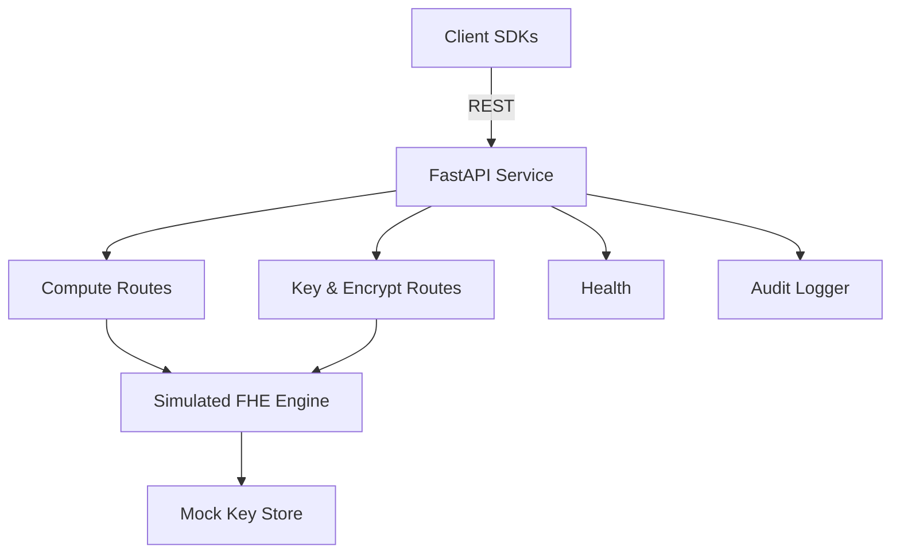

# Homomorphic Encryption Microservice (Simulated FHE)

Production-style FastAPI microservice demonstrating encrypted computation workflows with a safe, **simulated** fully homomorphic encryption (FHE) engine. Clients send ciphertexts, the server performs arithmetic without touching plaintext, and returns encrypted results. The project includes Python/JavaScript SDKs, an ops dashboard, and automated tests.

> ⚠️ **Educational only.** The encryption is simulated to avoid heavyweight dependencies. Do **not** use this code to protect sensitive data.

## Features
- Simulated FHE engine supporting key generation, encryption/decryption, addition, multiplication, dot product, polynomial evaluation, mean, and a tiny linear model.
- REST API powered by FastAPI with rate-limiting stubs, audit logs, and health checks.
- Python and JavaScript SDKs for encrypt → compute → decrypt flows.
- Static dashboard summarizing health, ciphertext sizes, and audit events.
- Comprehensive documentation, security guidelines, and contribution process.

## Quickstart
```bash
python -m venv .venv
source .venv/bin/activate
pip install -e .[development]
uvicorn server.main:app --reload
```

Then open `http://localhost:8000/docs` for interactive API docs.

### Configuration
Set environment variables (loaded via `HEM_` prefix) to adjust runtime behavior:

| Variable | Default | Description |
| --- | --- | --- |
| `HEM_SERVICE_NAME` | `HEM Microservice` | Display name for root endpoint |
| `HEM_RATE_LIMIT_PER_MINUTE` | `120` | Soft request budget per minute (0 disables limiter) |
| `HEM_ENABLE_SIMULATED_DECRYPT` | `True` | Whether `/decrypt` is exposed (disable for production) |
| `HEM_AUDIT_LOG_PATH` | `logs/audit.log` | File path for audit logs |

Configuration is powered by `pydantic.BaseSettings` with an optional `.env` file for local overrides.

### Repository Tree
```
server/              FastAPI app, simulated FHE engine, routes, security utilities
client/python/       Python SDK for encrypt → compute → decrypt flows
client/js/           JavaScript SDK mirroring the Python helper
dashboard/           Static monitoring dashboard
docs/                Architecture and API documentation
tests/               Pytest suite for engine and API integration
```

### Minimal Mermaid View


## API Overview
- `POST /keys/generate` – create a simulated keypair
- `POST /encrypt` – encrypt numeric vectors
- `POST /compute/add` – add two ciphertexts
- `POST /compute/mul` – multiply ciphertexts element-wise
- `POST /compute/dot` – dot product of vectors
- `POST /compute/polynomial` – evaluate polynomial coefficients on ciphertext
- `POST /compute/mean` – compute mean
- `POST /compute/linear` – run a linear model (weights + bias)
- `POST /decrypt` – decrypt ciphertext (demo only; disable in prod)
- `GET /health` – service health

Detailed request/response bodies are documented in [docs/API.md](docs/API.md).

## Example (Python SDK)
```python
from client.python.client import HEMClient

client = HEMClient()
client.generate_keys()
ct = client.encrypt([1.2, 2.3, 3.4])
ct_sum = client.add(ct, ct)
values = client.decrypt(ct_sum)
print(values)  # simulated decrypted values
```

## Example (JavaScript SDK)
```javascript
import HEMClient from './client/js/client.js';

const client = new HEMClient('http://localhost:8000');
const { ciphertext } = await client.encrypt([1, 2, 3]);
const added = await client.add(ciphertext, ciphertext);
const { values } = await client.decrypt(added);
console.log(values);
```

## Repository Layout
```
server/              FastAPI app, HE engine, routes, security utilities
client/python/       Python SDK
client/js/           JavaScript SDK
dashboard/           Static monitoring dashboard
docs/                Architecture + API documentation
tests/               Pytest suite for encryption + operations
```

## Security Model
- Keys are generated server-side and stored in a mocked in-memory key store.
- Ciphertexts are bound to the current key; cross-key operations are rejected for safety.
- Decrypt endpoint is enabled for simulation but can be disabled in `server/utils/config.py`.
- No private keys are ever exposed over the API.
- Audit logging captures all operations for traceability.

## Limitations
- Encryption is simulated and **not** cryptographically secure.
- Rate limiting and auth are lightweight stubs; integrate a gateway or provider for production.

## Testing
```bash
pytest
ruff check .
black --check .
```

## Development Workflow
- Use the provided [`.devcontainer`](.devcontainer/devcontainer.json) to spin up a reproducible VS Code environment.
- Run `ruff check .` and `black --check .` prior to commits; CI enforces both along with pytest.
- Document changes and keep the **simulated** nature of encryption clear in all contributions.

## Deployment & Hardening Checklist
- Disable `/decrypt` in `server/utils/config.py` for non-demo deployments.
- Place the service behind TLS termination and authentication (e.g., API gateway).
- Replace the mock key store with an HSM/KMS-backed implementation.
- Tune rate limiting and enable logging aggregation for audit trails.

## License
[MIT](LICENSE)
